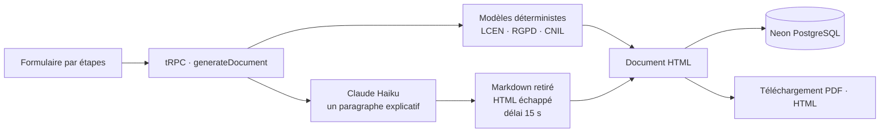

<div align="center">

# ConformeFR

**Un générateur gratuit de mentions légales et de politiques de confidentialité RGPD, où le droit reste déterministe et où l'IA se contente d'expliquer.**

[Site en ligne](https://conformefr.com) · [English version](README.md) · [Étude de cas](https://teebostudio.fr/portfolio/conformefr)


</div>

## Pourquoi ce dépôt peut vous intéresser

Tout site professionnel français doit publier des mentions légales et, dès qu'il collecte des données personnelles, une politique de confidentialité. Se tromper, c'est une infraction pénale dans le premier cas (un an d'emprisonnement et 75 000 € d'amende pour une personne physique, art. 1-2 LCEN) et un manquement au RGPD dans le second.

C'est donc un bon terrain pour une question qui dépasse le droit : **comment utiliser un LLM dans un domaine où une phrase inventée engage la responsabilité ?** La réponse de ConformeFR :

1. **La structure juridique est du code.** Chaque clause vient de modèles TypeScript écrits à la main. Les règles obligatoires sont rattachées à un article de loi précis et couvertes par des tests (voir le tableau ci-dessous).
2. **Le LLM rédige un seul paragraphe** : l'explication, en langage clair, des raisons pour lesquelles le site traite des données, dans la politique de confidentialité. Il ne touche jamais à une clause.
3. **Sa réponse est traitée comme une entrée non fiable** : markdown retiré, HTML échappé, délai maximal de 15 s, et si l'appel échoue, le document est généré quand même.
4. **Quand le LLM ne peut pas savoir, on ne lui demande pas.** Une première version demandait à Claude de décrire l'activité de l'entreprise à partir de son seul nom. Un audit a montré qu'il inventait des activités : la fonction a été retirée plutôt que rafistolée.

## Fonctionnalités

- Formulaire par étapes qui s'adapte au statut (entrepreneur individuel / EI, société, association, particulier) et au type de site (vitrine, e-commerce, blog, SaaS).
- Mentions légales, politique de confidentialité, ou les deux, relues à l'écran puis téléchargées en **PDF** ou en **HTML prêt à coller** — gratuit, sans compte.
- Contrôles de cohérence : SIRET à 14 chiffres, hébergeur américain sans transfert hors UE déclaré, cookies qui exigent un bandeau de consentement.
- Accessibilité vérifiée avec axe sur le formulaire, les documents et les pages légales (WCAG 2.1 AA, 0 violation en clair et en sombre) ; performance Lighthouse mobile de 98 à 100.

<p align="center">
  
  
</p>

## Règles juridiques codées

Chaque règle est implémentée dans [`src/lib/templates`](src/lib/templates) et couverte par au moins un test dans [`__tests__`](src/lib/templates/__tests__).

| Règle | Source |
|---|---|
| Identité de l'éditeur : nom, prénoms et domicile (personne physique) ou dénomination et siège social (personne morale), **téléphone**, numéro d'immatriculation, capital social | [LCEN, art. 1-1](https://www.legifrance.gouv.fr/loda/id/JORFTEXT000000801164) |
| Hébergeur : nom, adresse et téléphone | [LCEN, art. 1-1](https://www.legifrance.gouv.fr/loda/id/JORFTEXT000000801164) |
| Numéro de TVA intracommunautaire des vendeurs en ligne | [LCEN, art. 19](https://www.legifrance.gouv.fr/loda/article_lc/LEGIARTI000032236011) |
| Mention « EI » après le nom de l'entrepreneur individuel | [Code de commerce, art. R526-27](https://www.legifrance.gouv.fr/codes/article_lc/LEGIARTI000045697814) |
| Médiateur de la consommation affiché sur les sites e-commerce | [Code de la consommation, art. L616-1](https://www.legifrance.gouv.fr/codes/article_lc/LEGIARTI000032224762) |
| Information des personnes (responsable, DPO, finalités, bases légales, destinataires, durées, transferts, droits) | RGPD, art. 13 |
| Cookies non essentiels seulement après consentement ; refuser doit être aussi simple qu'accepter ; les réglages du navigateur ne suffisent pas | [Lignes directrices et FAQ de la CNIL](https://www.cnil.fr/fr/cookies-et-autres-traceurs/regles/cookies/FAQ) |
| Droit de définir des directives post-mortem | Loi Informatique et Libertés, art. 85 |

Une erreur ? [Ouvrez une issue](https://github.com/TeeBo8/conforme/issues) en citant l'article de loi : c'est la contribution la plus utile au projet.

## Fonctionnement



| Fichier | Rôle |
|---|---|
| [`src/lib/templates/mentions-legales.ts`](src/lib/templates/mentions-legales.ts), [`politique-conf.ts`](src/lib/templates/politique-conf.ts) | Les documents juridiques, sous forme de code |
| [`src/lib/templates/entites.ts`](src/lib/templates/entites.ts) | Règles partagées par le formulaire et les modèles (formes juridiques, SIRET, hébergeurs connus) |
| [`src/lib/templates/escape.ts`](src/lib/templates/escape.ts) | Chaque champ saisi et chaque phrase du LLM est échappé avant d'arriver dans le HTML |
| [`src/server/api/routers/document.ts`](src/server/api/routers/document.ts) | Génération des documents et unique appel au LLM, encadré |
| [`src/lib/pdf`](src/lib/pdf) | Rendu PDF côté serveur |

## Stack

Next.js 16 (App Router) · TypeScript · Tailwind CSS v4 · shadcn/ui · tRPC · Drizzle ORM · Neon PostgreSQL · API Anthropic (Claude Haiku 4.5) · @react-pdf/renderer · Vitest · Vercel

## Lancer le projet en local

Prérequis : Node.js 20+, pnpm, une base PostgreSQL (un projet [Neon](https://neon.tech) gratuit suffit).

```bash
git clone https://github.com/TeeBo8/conforme.git
cd conforme
pnpm install
cp .env.example .env.local   # renseignez DATABASE_URL et BETTER_AUTH_SECRET
DATABASE_URL="postgresql://..." pnpm drizzle-kit push   # crée les tables (syntaxe bash)
pnpm dev
```

`ANTHROPIC_API_KEY` est optionnelle : sans elle, les documents sont générés sans le paragraphe explicatif.

```bash
pnpm test    # 53 tests unitaires sur les modèles juridiques et l'échappement
pnpm lint
pnpm build
```

### Deux pièges bons à connaître

- **Better Auth + Turbopack.** `better-auth` figure dans `serverExternalPackages` : son hook React (`useSession`) s'exécute alors avec une deuxième copie de React au rendu serveur et plante (`Cannot read properties of null (reading 'useRef')`). Les composants qui l'utilisent sont chargés avec `dynamic(..., { ssr: false })` — voir [`ClientConnexionForm.tsx`](src/app/connexion/ClientConnexionForm.tsx). Retirer le paquet des externals fait planter le build Turbopack à la place.
- **Kysely 0.29.** `@better-auth/kysely-adapter` importe des constantes que Kysely 0.29 a déplacées, ce qui casse le build Turbopack. Un [`pnpm patch`](patches/kysely@0.29.2.patch) de deux lignes les rétablit.

## Statut

ConformeFR est un projet personnel gratuit, en production sur [conformefr.com](https://conformefr.com). L'intégration Stripe d'une ancienne version payante est toujours dans le code, mais désactivée côté serveur (`PAYMENTS_ENABLED = false`).

## Avertissement

Les documents générés sont fournis à titre informatif et **ne constituent pas un conseil juridique**. Ils couvrent les situations courantes ; pour une activité réglementée ou un cas complexe, faites-les relire par un professionnel du droit.

## Auteur

Réalisé par **Thibault Leture** — [TeeboStudio](https://teebostudio.fr), développeur Next.js freelance à Bordeaux. L'[étude de cas](https://teebostudio.fr/portfolio/conformefr) raconte l'histoire du projet.
