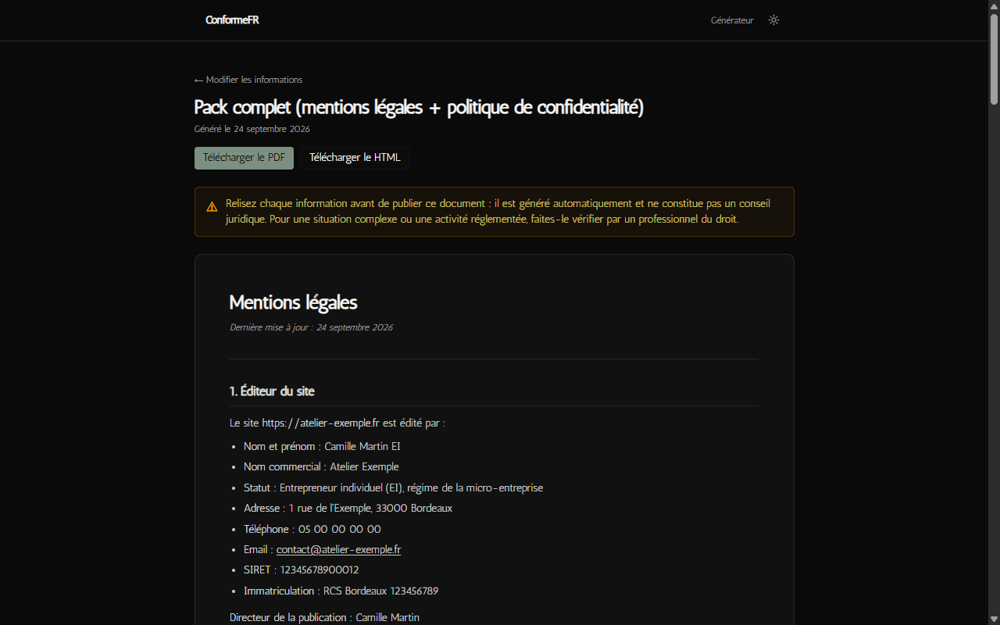
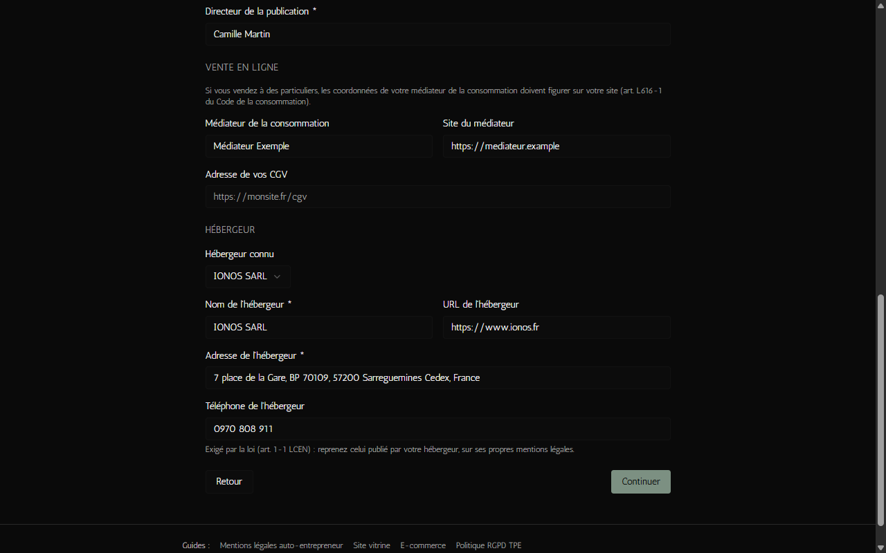
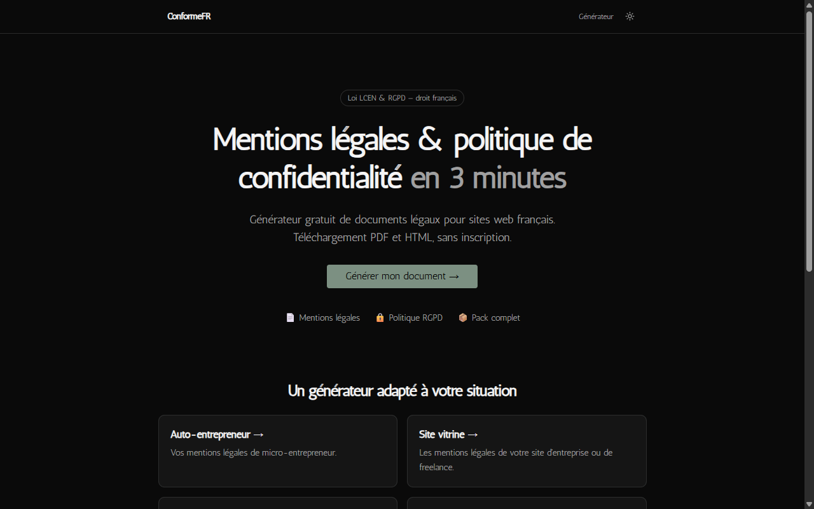
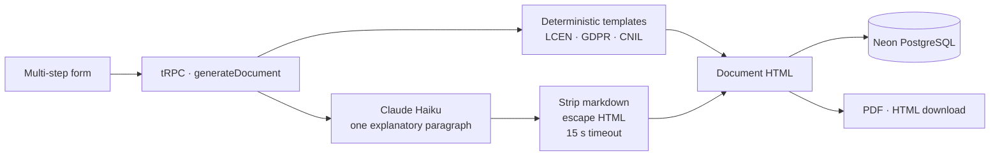

<div align="center">

# ConformeFR

**A free generator of French legal pages — _mentions légales_ and GDPR privacy policies — where the law stays deterministic and the LLM only explains.**

[Live site](https://conformefr.com) · [Version française](README.fr.md) · [Case study](https://teebostudio.fr/portfolio/conformefr)




</div>

## Why this repo might interest you

Every professional website in France must publish legal notices (_mentions légales_) and, as soon as it collects personal data, a privacy policy. Getting them wrong is a criminal offence in the first case (one year in prison and €75,000 fine for an individual, art. 1-2 LCEN) and a GDPR breach in the second.

That makes it a good playground for a question that matters beyond law: **how do you use an LLM in a domain where a made-up sentence is a liability?** ConformeFR's answer:

1. **The legal structure is plain code.** Every clause comes from hand-written TypeScript templates. The mandatory rules are tied to a specific article of law and covered by tests (see the table below).
2. **The LLM writes exactly one paragraph**: a plain-language explanation of why the site processes data, in the privacy policy. It never touches a clause.
3. **Its output is treated as untrusted input**: markdown is stripped, HTML is escaped, the call times out after 15 s, and if it fails the document is generated anyway.
4. **When the LLM cannot know, it is not asked.** An early version asked Claude to describe the company's activity from its name alone. An audit showed it was inventing businesses, so that feature was removed rather than patched.

## Features

- Multi-step form that adapts to the legal status (sole trader / _EI_, company, association, private individual) and to the kind of site (showcase, e-commerce, blog, SaaS).
- Legal notice and privacy policy, or both, previewed on screen then downloaded as **PDF** or **copy-paste HTML** — free, no account.
- Consistency checks: 14-digit SIRET, US host without a declared transfer outside the EU, cookies that require a consent banner.
- Accessibility checked with axe on the form, documents and legal pages (WCAG 2.1 AA, 0 violations in light and dark mode); Lighthouse mobile performance 98–100.

<p align="center">
  
  
</p>

## Legal rules encoded

Each rule below is implemented in [`src/lib/templates`](src/lib/templates) and has at least one test in [`__tests__`](src/lib/templates/__tests__).

| Rule | Source |
|---|---|
| Publisher identity: name/first name and address (individual) or company name and registered office, **phone number**, registration number, share capital | [LCEN, art. 1-1](https://www.legifrance.gouv.fr/loda/id/JORFTEXT000000801164) |
| Hosting provider: name, address and phone number | [LCEN, art. 1-1](https://www.legifrance.gouv.fr/loda/id/JORFTEXT000000801164) |
| Intra-EU VAT number for online sellers | [LCEN, art. 19](https://www.legifrance.gouv.fr/loda/article_lc/LEGIARTI000032236011) |
| "EI" appended to a sole trader's name | [Code de commerce, art. R526-27](https://www.legifrance.gouv.fr/codes/article_lc/LEGIARTI000045697814) |
| Consumer mediator shown on e-commerce sites | [Code de la consommation, art. L616-1](https://www.legifrance.gouv.fr/codes/article_lc/LEGIARTI000032224762) |
| Information to give data subjects (controller, DPO, purposes, legal bases, recipients, retention, transfers, rights) | GDPR, art. 13 |
| Non-essential cookies only after consent; refusing must be as easy as accepting; browser settings alone are not consent | [CNIL guidelines and FAQ](https://www.cnil.fr/fr/cookies-et-autres-traceurs/regles/cookies/FAQ) |
| Right to set post-mortem directives | Loi Informatique et Libertés, art. 85 |

Found a mistake? Please [open an issue](https://github.com/TeeBo8/conforme/issues) with the article of law — legal corrections are the most valuable contribution here.

## How it works



| Path | Role |
|---|---|
| [`src/lib/templates/mentions-legales.ts`](src/lib/templates/mentions-legales.ts), [`politique-conf.ts`](src/lib/templates/politique-conf.ts) | The legal documents, as code |
| [`src/lib/templates/entites.ts`](src/lib/templates/entites.ts) | Rules shared by the form and the templates (legal forms, SIRET, known hosts) |
| [`src/lib/templates/escape.ts`](src/lib/templates/escape.ts) | Every user field and LLM sentence is escaped before it reaches the HTML |
| [`src/server/api/routers/document.ts`](src/server/api/routers/document.ts) | Generation endpoint and the single, guarded LLM call |
| [`src/lib/pdf`](src/lib/pdf) | Server-side PDF rendering |

## Stack

Next.js 16 (App Router) · TypeScript · Tailwind CSS v4 · shadcn/ui · tRPC · Drizzle ORM · Neon PostgreSQL · Anthropic API (Claude Haiku 4.5) · @react-pdf/renderer · Vitest · Vercel

## Run it locally

Requirements: Node.js 20+, pnpm, a PostgreSQL database (a free [Neon](https://neon.tech) project works).

```bash
git clone https://github.com/TeeBo8/conforme.git
cd conforme
pnpm install
cp .env.example .env.local   # fill in DATABASE_URL and BETTER_AUTH_SECRET
DATABASE_URL="postgresql://..." pnpm drizzle-kit push   # create the tables (bash syntax)
pnpm dev
```

`ANTHROPIC_API_KEY` is optional: without it, documents are generated without the explanatory paragraph.

```bash
pnpm test    # 53 unit tests on the legal templates and escaping
pnpm lint
pnpm build
```

### Two gotchas worth knowing

- **Better Auth + Turbopack.** `better-auth` is listed in `serverExternalPackages`, so its React hook (`useSession`) runs against a second copy of React during SSR and crashes with `Cannot read properties of null (reading 'useRef')`. Components that use it are loaded with `dynamic(..., { ssr: false })` — see [`ClientConnexionForm.tsx`](src/app/connexion/ClientConnexionForm.tsx). Removing the package from the externals makes the Turbopack build crash instead.
- **Kysely 0.29.** `@better-auth/kysely-adapter` imports constants that Kysely 0.29 moved, which breaks the Turbopack build. A two-line [`pnpm patch`](patches/kysely@0.29.2.patch) restores them.

## Status

ConformeFR is a free personal project, in production at [conformefr.com](https://conformefr.com). The Stripe integration from an earlier paid version is still in the code but disabled server-side (`PAYMENTS_ENABLED = false`).

## Disclaimer

Generated documents are provided for information only and are **not legal advice**. They cover common situations; for regulated activities or complex cases, have them reviewed by a legal professional.

## Author

Built by **Thibault Leture** — [TeeboStudio](https://teebostudio.fr), Next.js freelance developer in Bordeaux. Read the [case study](https://teebostudio.fr/portfolio/conformefr) for the story behind the project.
